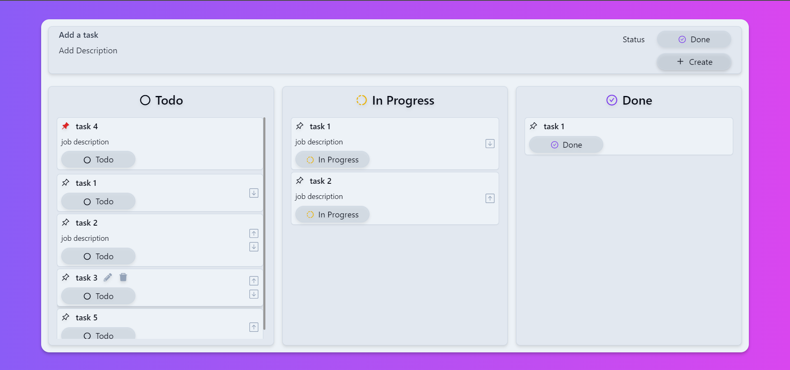

# TaskMaster

TaskMaster is a powerful task management tool designed to help you stay organized and boost your productivity.

## Description

TaskMaster is a web application that allows you to efficiently manage and organize your tasks. Whether you're working on personal projects or collaborating with a team, TaskMaster provides a streamlined workflow and intuitive interface to keep you on track.

## Features

- **Add tasks**: Easily add new tasks to your task list with just a few clicks.
- **Manage tasks**: Mark tasks as complete, update task details, or delete tasks as needed.
- **Sort tasks**: Arrange your tasks based on priority, due date, or any other criteria to stay organized.

## Technologies Used

TaskMaster is built with the following technologies:

- **Next.js**: A React framework that enables server-side rendering and provides a robust development environment for building modern web applications.

- **TypeScript**: A statically typed superset of JavaScript that enhances code quality, readability, and maintainability.

- **Tailwind CSS**: A utility-first CSS framework that enables rapid UI development by providing a wide range of pre-built components and styling options.

## Installation

Follow these steps to install and run TaskMaster on your local machine:

1. Clone the repository: `git clone https://github.com/your-username/TaskMaster.git`
2. Install dependencies: `npm install`
3. Set up a Firebase project and configure the necessary credentials.
4. Update the Firebase configuration in the project.
5. Start the development server: `npm run dev`
6. Open the web application in your browser: `http://localhost:3000`

## Contributing

Contributions are welcome! If you encounter any issues or have suggestions for improvements, please open an issue or submit a pull request. Make sure to follow the project's code of conduct.

## Contact

For any questions, feedback, or support requests, please reach out to us at [nguyenhauw2005@gmail.com](mailto:nguyenhauw2005@gmail.com) or [nguyenthanhhau.contact@gmail.com](mailto:nguyenthanhhau.contact@gmail.com).

## License

TaskMaster is licensed under the [MIT License](LICENSE).